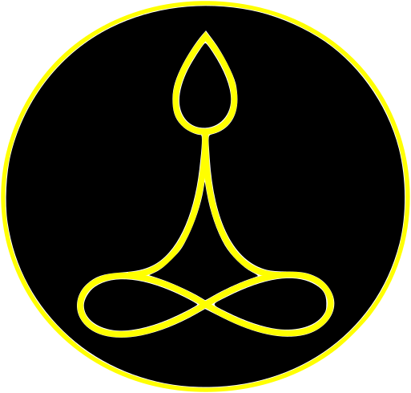

# MyLogo

Há tempos desejo criar um desenho que eu possa usar como marca pessoal.

Construi um que me satisfez há uns meses atrás, mostro logo após o texto explicativo.

Ele foi feito a partir do desenho de curvas usando o programa R (https://cran.r-project.org/), geração de arquivo SVG e (pós) edição usando o programa Inkscape (https://inkscape.org/).

Os scripts do R estão na pasta ./curvas

Esse logo deu alguns problemas para imprimir: 
	- O SVG que gerei tinha os preenchimentos posicionados diferente quando enviei para a gráfica, felizmente a pessoa da gráfica notou e corrigiu.
	- O SVG gerado pelo R é feito por concatenação de linhas então a impressão fica pixelada. 
	
Devido aos problemas, resolvi desenhar o logo direto no Inkscape usando curvas de bézier. Notei que quando desenho um polígono e deleto um ponto intermediário os vizinhos recebem 'linhas de força' e a concatenação dos lados se torna uma curva. Com isso consegui desenhar algo que é aproximadamente um círculo, que é a base do logo.

Também assisiti a um vídeo explicando como usar curvas de bézier no Inkscape: https://www.google.com/search?channel=fs&client=ubuntu&q=inkscape+draw+bezier+curves#fpstate=ive&vld=cid:5a1f3f4f,vid:AAgWhnf_p3k.

Os resultados são os arquivos /curvas/bezier-logo* . Um exemplo está no topo da página.

